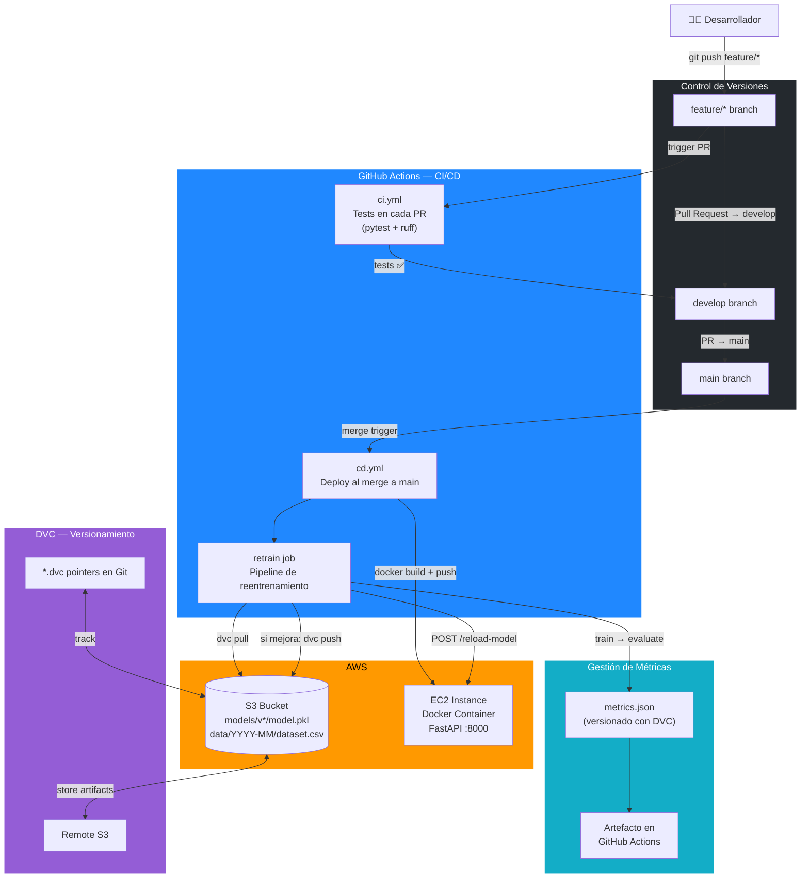
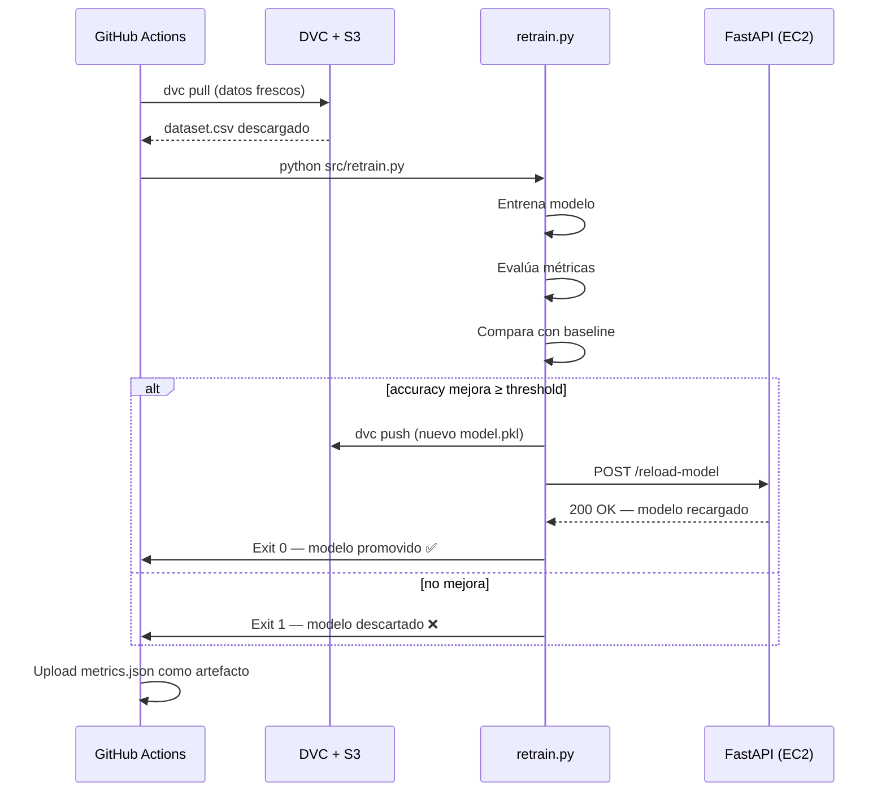

# Proyecto Final — MLOps End-to-End


> Curso: BCD4205 – Machine Learning Operations  
> Entrega: Repositorio GitHub + URL del servicio desplegado

## URL del Servicio

```
http://<EC2_PUBLIC_IP>:8000
```

Endpoints disponibles:
- `GET  /health`  — Liveness probe (retorna `200 OK`)
- `POST /predict` — Predicción individual
- `POST /reload-model` — Recarga el modelo en memoria
- `GET  /docs`    — Documentación interactiva (Swagger UI)

---

## Diagrama de Arquitectura



### Flujo del Reentrenamiento Automático



---

## Estructura del Repositorio

```
proyecto-final/
├── .github/
│   └── workflows/
│       ├── ci.yml          # Tests en cada PR
│       └── cd.yml          # Deploy al merge a main + reentrenamiento
├── src/
│   ├── train.py            # Script de entrenamiento
│   ├── predict.py          # Lógica de inferencia (con caché)
│   └── retrain.py          # Pipeline de reentrenamiento automático
├── api/
│   └── main.py             # FastAPI — /health, /predict, /reload-model
├── tests/
│   └── test_predict.py     # Tests unitarios e integración
├── data/
│   └── dataset.csv.dvc     # Puntero DVC (el CSV está en S3)
├── models/
│   └── model.pkl.dvc       # Puntero DVC (el pkl está en S3)
├── Dockerfile              # Multi-stage build
├── pyproject.toml          # Dependencias y configuración de herramientas
├── requirements.txt
├── metrics.json            # Métricas del último entrenamiento (DVC tracked)
├── .dvc/
│   └── config              # Remote S3 configurado
├── .env.example            # Variables de entorno documentadas (sin valores)
└── README.md               # Este archivo
```

---

## Branching Strategy

| Rama | Propósito |
|------|-----------|
| `main` | Producción — protegida, solo merge via PR |
| `develop` | Integración — rama base para features |
| `feature/*` | Desarrollo de funcionalidades específicas |

**Convención de commits** (tiempo presente):
```
Add retrain trigger to CD pipeline
Fix model reload endpoint
Update DVC remote configuration
```

---

## Setup Local

### 1. Clonar y configurar variables

```bash
git clone https://github.com/TU_USUARIO/TU_REPO.git
cd proyecto-final
cp .env.example .env
# Edita .env con tus credenciales AWS
```

### 2. Instalar dependencias

```bash
pip install -r requirements.txt
```

### 3. Configurar DVC con tu bucket S3

```bash
# Edita .dvc/config y reemplaza "your-mlops-bucket-name" con tu bucket real
dvc remote modify s3remote access_key_id $AWS_ACCESS_KEY_ID
dvc remote modify s3remote secret_access_key $AWS_SECRET_ACCESS_KEY
```

### 4. Descargar datos y modelo

```bash
dvc pull
```

### 5. Entrenar el modelo

```bash
python src/train.py
```

### 6. Levantar la API localmente

```bash
uvicorn api.main:app --reload
# Disponible en http://localhost:8000/docs
```

### 7. Con Docker

```bash
docker build -t mlops-api .
docker run -p 8000:8000 \
  -e AWS_ACCESS_KEY_ID=... \
  -e AWS_SECRET_ACCESS_KEY=... \
  mlops-api
```

---

## GitHub Secrets Requeridos

Configura estos secrets en `Settings → Secrets and variables → Actions`:

| Secret | Descripción |
|--------|-------------|
| `AWS_ACCESS_KEY_ID` | Credencial AWS |
| `AWS_SECRET_ACCESS_KEY` | Credencial AWS |
| `AWS_REGION` | Región de AWS (ej. `us-east-1`) |
| `S3_BUCKET` | Nombre del bucket S3 |
| `EC2_HOST` | IP pública de la instancia EC2 |
| `EC2_USER` | Usuario SSH (ej. `ubuntu`) |
| `EC2_SSH_KEY` | Llave privada SSH (contenido del `.pem`) |

---

## Convención de Nombres en S3

```
s3://your-bucket/
├── dvc-store/              # Caché DVC (gestionado automáticamente)
├── models/
│   ├── v1.0.0/model.pkl
│   ├── v1.1.0/model.pkl
│   └── latest/model.pkl
└── data/
    ├── 2025-04/dataset.csv
    └── 2025-05/dataset.csv
```

---

## Ejecutar Tests

```bash
pytest tests/ -v --cov=src --cov=api
```

---

## Referencias

- [Repositorio de referencia del curso](https://github.com/NapsterZ4/ci_cd_process)
- [Documentación DVC](https://dvc.org/doc)
- [FastAPI](https://fastapi.tiangolo.com)
- [GitHub Actions](https://docs.github.com/en/actions)
