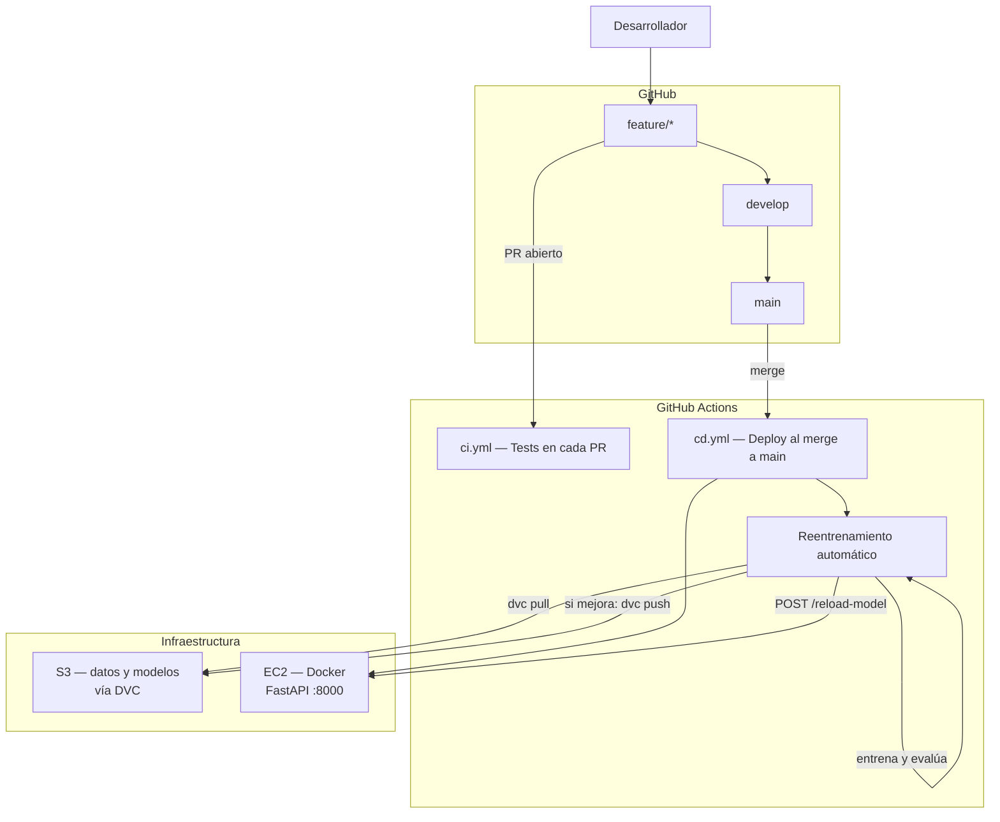

# MLOps Proyecto Final

> Curso: BCD4205 – Machine Learning Operations  
> Integrantes: Susana Herrera y Kendra Gutiérrez

## URL del Servicio

```
http://100.31.100.179:8000
```

| Endpoint | Método | Descripción |
|---|---|---|
| `/health` | GET | Verifica que el servicio está activo |
| `/predict` | POST | Clasifica la intención de un texto |
| `/chat` | POST | Respuesta generada con Llama3 (Groq) |
| `/reload-model` | POST | Recarga el modelo en memoria |
| `/docs` | GET | Documentación interactiva (Swagger) |

---

## Diagrama de Arquitectura



---

## Estructura del Repositorio

```
mlops-proyecto-final/
├── .github/workflows/
│   ├── ci.yml          # Tests en cada PR
│   └── cd.yml          # Deploy + reentrenamiento al merge a main
├── api/
│   └── main.py         # FastAPI — endpoints del chatbot
├── src/
│   ├── train.py        # Entrenamiento del modelo
│   ├── predict.py      # Inferencia con caché
│   └── retrain.py      # Pipeline de reentrenamiento automático
├── tests/
│   └── test_predict.py # Tests unitarios e integración
├── data/
│   └── dataset.csv.dvc # Puntero DVC (CSV en S3)
├── models/
│   └── model.pkl.dvc   # Puntero DVC (modelo en S3)
├── Dockerfile
├── requirements.txt
└── .dvc/config         # Remote S3 configurado
```

---

## Stack

| Componente | Tecnología |
|---|---|
| Modelo | TF-IDF + Logistic Regression (scikit-learn) |
| LLM | Llama3 via Groq (gratuito) |
| API | FastAPI + Uvicorn |
| Contenedor | Docker |
| Infraestructura | AWS EC2 + S3 |
| Versionamiento | DVC |
| CI/CD | GitHub Actions |

---

## Setup Local

```bash
git clone https://github.com/kndrrv/mlops-proyecto-final.git
cd mlops-proyecto-final
pip install -r requirements.txt
dvc pull data/dataset.csv
python src/train.py
uvicorn api.main:app --reload
```

---

## GitHub Secrets Requeridos

| Secret | Descripción |
|---|---|
| `AWS_ACCESS_KEY_ID` | Credencial AWS |
| `AWS_SECRET_ACCESS_KEY` | Credencial AWS |
| `AWS_REGION` | Región de AWS |
| `S3_BUCKET` | Nombre del bucket S3 |
| `EC2_HOST` | IP pública del EC2 |
| `EC2_USER` | Usuario SSH |
| `EC2_SSH_KEY` | Llave privada SSH |
| `GROQ_API_KEY` | API key de Groq |
